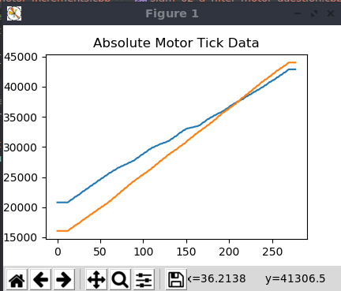
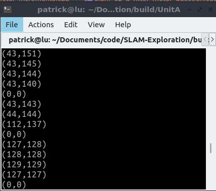
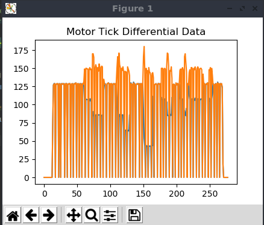
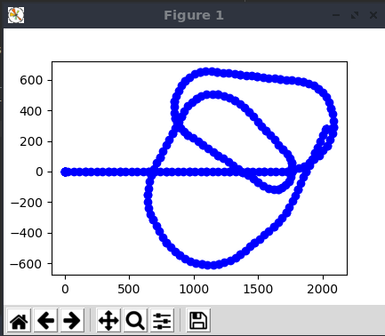

# SLAM-Exploration
This will be a repository for exploring SLAM topics based lectures by Professor Claus Brenner. Rather than Python, the associated code for the lectures and assignments will be written in modern C++. 

----


### Getting Started

##### Course Information
* [Link to lectures on youtube](https://www.youtube.com/watch?list=PLpUPoM7Rgzi_7YWn14Va2FODh7LzADBSm&v=B2qzYCeT9oQ&feature=emb_title)
* [Link to the Python code used in lectures](https://www.youtube.com/redirect?redir_token=BqHAGsMBd_DMimERFcC--3jihDR8MTU4NzYxNjcyMUAxNTg3NTMwMzIx&q=https%3A%2F%2Fdrive.google.com%2Fopen%3Fid%3D0BxwK9_xWk7ewUTFKVEIydTdfMzg&v=B2qzYCeT9oQ&event=video_description)


##### Prequisites
* CMake
* Compiler version that supports C++17

##### Build and Setup


1) Clone repo

    ```git clone git@github.com:patrick--/SLAM-Exploration.git```
    
2) Move into clone repo

    ```cd SLAM-Exploration```
    
3) Create build directory and generate build dependencies
     ```sh
      mkdir build && cd build
      cmake ..
      ```
      
4) Build All Examples
    ```sh
     make
     ```
     
5) Run Examples
   ```sh
     ./UnitA/slam_01_a_plot_motor_ticks
     ```

---


### File Overview

#### Unit A 
###### Resource Files
* `robot4_motors.txt` - Sample motor encoder data from robot

###### Example Code
* `slam_01_a_plot_motor_ticks.cpp` - Plot the raw motor encoder data

  
  
* `slam_01_b_print_motor_increments.cpp` - Print differential motor encoder data 

   

* `slam_01_c_plot_motor_increments.cpp` - Plot differential motor encoder data

   
###### Solved Assignments

* `slam_02_a_filter_motor_question.cpp` - Plot robots movement in 2D utilizing motor sensor data and motion equations.

   